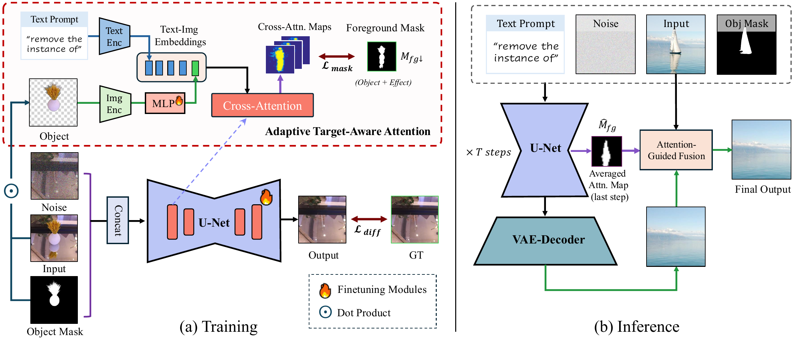

<div align="center">
<div style="text-align: center;">
    
    <h2>Precise Object and Effect Removal with Adaptive Target-Aware Attention</h2>
</div>

<div>
    <a href="https://zjx0101.github.io/" target='_blank'>Jixin Zhao<sup>*</sup></a>&emsp;
    <a href='https://wzhouxiff.github.io' target='_blank'>Zhouxia Wang</a>&emsp;
    <a href='https://pq-yang.github.io/' target='_blank'>Peiqing Yang</a>&emsp;
    <a href='https://shangchenzhou.com/' target='_blank'>Shangchen Zhou<sup>*,†</sup>
</div>
<div>
    S-Lab, Nanyang Technological University&emsp; 
</div>

<div>
    <strong>CVPR 2026 </strong>
</div>


<div>
    <h4 align="center">
        <a href="https://zjx0101.github.io/projects/ObjectClear/" target='_blank'>
        
        </a>
        <a href="https://arxiv.org/abs/2505.22636" target='_blank'>
        
        </a>
        <a href="https://huggingface.co/spaces/jixin0101/ObjectClear" target='_blank'>
        
        </a>
        <a href="https://huggingface.co/datasets/sczhou/OBERDataset_ObjectClear" target='_blank'>
        
        </a>
        
    </h4>
</div>

<strong>ObjectClear is an object removal model that can jointly eliminate the target object and its associated effects leveraging Object-Effect Attention, while preserving background consistency.</strong>

<div style="width: 100%; text-align: center; margin:auto;">
    
</div>

For more visual results, go checkout our <a href="https://zjx0101.github.io/projects/ObjectClear/" target="_blank">project page</a>

---
</div>


## ⭐ Update
- [2026.02] **🔥 OBER Dataset is Now Released!** Our training dataset is now publicly available on [Hugging Face](https://huggingface.co/datasets/sczhou/OBERDataset_ObjectClear) 🤗.
- [2025.09] We have released our [benchmark datasets](https://drive.google.com/drive/folders/12LA53ZPAG1uxdVXsn90L2qe6zCcp6aGF?usp=sharing) for evaluation, along with [our results](https://drive.google.com/drive/folders/1eUbIz5OS9yK6Ih8Y1qXoXuk_UWOcifcY?usp=sharing) to facilitate comparison.
- [2025.07] Release the inference code and Gradio demo.
- [2025.05] This repo is created.

### ✅ TODO
- [x] Release our training datasets
- [x] Release our benchmark datasets
- [x] ~~Release the inference code and Gradio demo~~


## 🎃 Overview



## 📷 OBER Dataset


OBER (OBject-Effect Removal) is a hybrid dataset designed to support research in object removal with effects, combining both camera-captured and simulated data. 

🔥 We have released the full dataset [OBERDataset_ObjectClear](https://huggingface.co/datasets/sczhou/OBERDataset_ObjectClear ) on Hugging Face. We hope it can serve as a strong training resource and benchmark for future object removal research.

> 🚩 Note that the OBER dataset are made available solely for **non-commercial** research use. Any use, reproduction, or redistribution must strictly comply with the terms of <a rel="license" href="./LICENSE">NTU S-Lab License 1.0</a>.


## ⚙️ Installation
1. Clone Repo
    ```bash
    git clone https://github.com/zjx0101/ObjectClear.git
    cd ObjectClear
    ```

2. Create Conda Environment and Install Dependencies
    ```bash
    # create new conda env
    conda create -n objectclear python=3.10 -y
    conda activate objectclear

    # install python dependencies
    pip3 install -r requirements.txt
    # [optional] install python dependencies for gradio demo
    pip3 install -r hugging_face/requirements.txt
    ```


## ⚡ Inference

### Quick Test
We provide some examples in the [`inputs`](./inputs) folder. **For each run, we take an image and its segmenatation mask as input.** <u>The segmentation mask can be obtained from interactive segmentation models such as [SAM2 demo](https://huggingface.co/spaces/fffiloni/SAM2-Image-Predictor)</u>. For example, the directory structure can be arranged as follows:
```
inputs
   ├─ imgs
   │   ├─ test-sample1.jpg      # .jpg, .png, .jpeg supported
   │   ├─ test-sample2.jpg
   └─ masks
       ├─ test-sample1.png
       ├─ test-sample2.png
```
Run the following command to try it out:

```shell
## Single image inference
python inference_objectclear.py -i inputs/imgs/test-sample1.jpg -m inputs/masks/test-sample1.png --guidance_scale 2.5 --use_fp16

## Batch inference on image folder
python inference_objectclear.py -i inputs/imgs -m inputs/masks --guidance_scale 2.5 --use_fp16
```

> **Note:** `--guidance_scale` controls the trade-off: higher values lead to stronger removal, while lower values better preserve background details.  
> The default setting is `--guidance_scale 2.5`. For all [benchmark results](https://drive.google.com/drive/folders/1eUbIz5OS9yK6Ih8Y1qXoXuk_UWOcifcY?usp=sharing) reported in our paper, we used `--guidance_scale 1.0`.


## 🪄 Interactive Demo
To get rid of the preparation for segmentation mask, we prepare a gradio demo on [hugging face](https://huggingface.co/spaces/jixin0101/ObjectClear) and could also [launch locally](./hugging_face). Just drop your image, assign the target masks with a few clicks, and get the object removal results!
```shell
cd hugging_face

# install python dependencies
pip3 install -r requirements.txt

# launch the demo
python app.py
```

<p align="center">
  
  
</p>


## 📝 License
**Non-Commercial Use Only Declaration**

The ObjectClear is made available for use, reproduction, and distribution strictly for non-commercial purposes. The code, models, and datasets are licensed under <a rel="license" href="./LICENSE">NTU S-Lab License 1.0</a>. Redistribution and use should follow this license.


## 📑 Citation
If you find our repo useful for your research, please consider citing our paper:

```bibtex
@InProceedings{zhao2026objectclear,
    title   = {Precise Object and Effect Removal with Adaptive Target-Aware Attention},
    author  = {Zhao, Jixin and Wang, Zhouxia and Yang, Peiqing and Zhou, Shangchen},
    booktitle = {CVPR},
    year    = {2026},
    }
```

## 📧 Contact
If you have any questions, please feel free to reach us at `jixinzhao0101@gmail.com` and `shangchenzhou@gmail.com`. 
